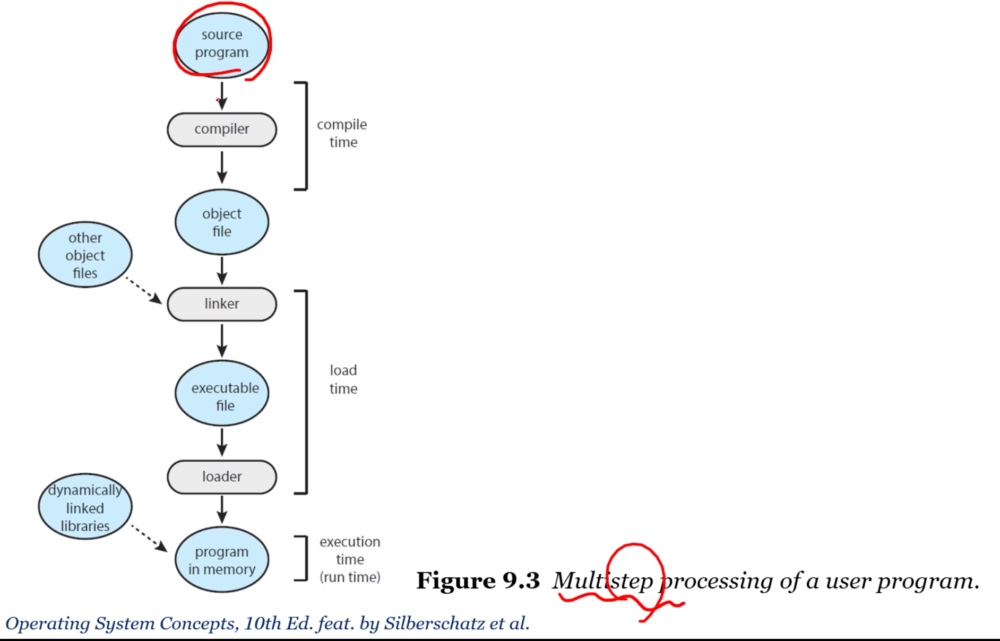

## 주메모리의 관리

프로세스란 메모리에 프로그램이 로드되어있는 상태. 메모리는 바이트 단위로 구성된 배열. PC가 가르키는 곳의 명령어를 불러온다. 

메모리에 어떻게 프로세스를 저장하고 관리할까? 따로따로 잘 관리하는게 멀티프로그래밍의 기본. 

base register, limit register. 여기서 벗어난 곳 접근하면 segmentation fault. 항상 체크해야되기 때문에 하드웨어로 구현.

컴파일러는 파일을 생성할 뿐, 이 파일이 메모리 어디에 있을지 모름. a라는 이름을 가진 주소공간이 어디 있을지는 컴파일러가. symbolic? 근데 0번지에서 시작하는건 아님. 시작번지를 OS가 결정하기 때문에 그때그때 다름. 

컴파일러는 symbolic 주소를 relocatable 주소로 바인딩해준다. 그리고 linker/loader가 이를 absolute 주소로 바꾼다. linker가 logical address, lodaer가 physical address. 

logical address: CPU가 만든 주소
physical address: 메모리 유닛에서 보여진 주소. memory-address 레지스터에 로드된 것. 

logical address space: 논리 주소의 집합. 
physical address space. 

MMU(Memory Management Unit): logical physical 변환해주는 하드웨어 기기. 
relocation register: base 레지스터. 

Dynamic loading: 전체 프로그램과 데이터가 물리 메모리에 있을 필요가 있을까? 램보다 실행파일이 큰 경우도 있고,,,
모든 루틴이 한꺼번에 로딩될 필요가 없다. 필요할때만! 

DLL: Dynamically Linked Libraries. shared library임. 

Static linking: 시스템 라이브러리를 다른 오브젝트 모듈처럼 로더가 로드함. 

dynamic linking: dynamic loading처럼 링킹을 실행 시간까지 미루는 것. 

shared library: DLL이 예시. 메인 메모리에 하나의 인스턴스만 있으며 여러 유저 프로세스들 간에 공유될 수 있다. 

**Contiguous Memory Allocation.** 여러 유저 프로세스들이 같은 메모리에 있다. 메모리를 필요로 하는 프로세스들에 어떻게 메모리를 할당해줄 수 있을까? 얘네는 통짜로 연속으로 올려져있음. 그래서 memory protection도 간단. 

memory allocation과정에 hole이 생기고 이걸 어떻게 관리하느냐가 중요. 

Fragmentation 문제. 남아 있는 공간은 많지만 쪼개지다보니 contiguous하지 않은 문제. 
external fragmentation. CMA를 하면 얘가 생김. 
internal fragmentation. 프로세스가 생각보다 적게 씀. paging을 하면 얘가 생김. 

10.12 문제 읽어보기. 
CMA는 통쨰로 메모리를 로딩하자. 
Segmentation은 쪼개긴하는데 종류별로 쪼개자. 
Paging은 똑같은 크기로 쪼개자. 
페이징 씀. 세그먼트 안씀~!

[조각모음?](http://en.wikipedia.org/wiki/Defragmentation)

## 페이징과 스와핑

Paging.
external fragmentaion이 거의 발생안하고 hole을 압축하는 과정이 필요 없음. 

가장 기본적인 방법. 물리 메모리를 고정 크기를 가지는 프레임으로 나눔. 그리고 논리적 메모리도 쪼개 여기에 매핑. 1mb에는 1kb 4개 있다 성열아,,,^^ 프로그램을 쪼개기 때문에 꼭 순서대로일 필요가 없음! logical address space는 physical과 완전 별개다. logical만 신경써서 프로그래밍하면 물리적인 주소는 운영체제가 알아서 해줌. 

주소 없이 페이지 번호와 오프셋으로 표현할 수 있다. 물리 메모리에 상당히 자유롭게 저장할 수 있다. 페이지 사이즈는 하드웨어에 따라 다르다. 근데 2의 지수배이긴 함. 

논리 주소가 2^m이고 페이지 크기가 2^n이면 high-order m-n비트는 페이지 넘버, 아래 n비트는 페이지 오프셋을 표현.

page table도 context switch에 포함되어야한다. 근데 얘네 사이즈 겁나 큼. 
PTBR - 페이지 테이블로의 포인터. 얘만 저장하자! 
TLB라는 캐시를 따로 둠. 하드웨어 엑세스라서 거의 시간이 안걸림. 

- TLB hit: TLB에 찾고자하는게 있음
- TLB miss: 없음
- hit ratio

CPU는 논리 주소로 프로그램이 설정한대로 연속적인 주소값으로 명령을 내리고 이는 메모리로 가기전에 각 페이지의 실제 메모리 주소가 저장되어 있는 테이블에서 물리 주소로 변경되어야 한다.

[출처](https://velog.io/@codemcd/%EC%9A%B4%EC%98%81%EC%B2%B4%EC%A0%9COS-13.-%ED%8E%98%EC%9D%B4%EC%A7%95)

[How does compiler lay out code in memory](https://stackoverflow.com/questions/19101449/how-does-compiler-lay-out-code-in-memory)

컴구 공부해야겠다,,,^^

페이징에서는 어떻게 메모리 보호? 각 프레임과 연관된 protection bit를 사용. 

Shared paging. 공유도 쉽다!

큰 페이지 테이블을 어떻게 관리할 수 있을까?

- Hierarchical Paging
- Hashed Page Table
- Inverted Page Table

Swapping
오 물리적 메모리보다 훨씬 큰 프로그램도 돌릴 수 있지 않을까???
극단적으로는 어떤 프로세스든 한 페이지만 있으면 됨. 
근데 프로세스 전체를 스와핑하는건 비용이 너무 심함. 
페이지 단위로 하는건 괜찮. 

오늘은 쉬어가는 날~
다음에 있는 demand paging을 위한 전단계. 

