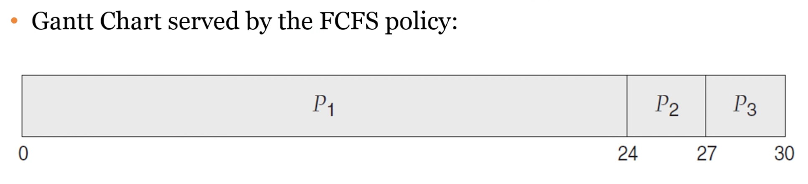
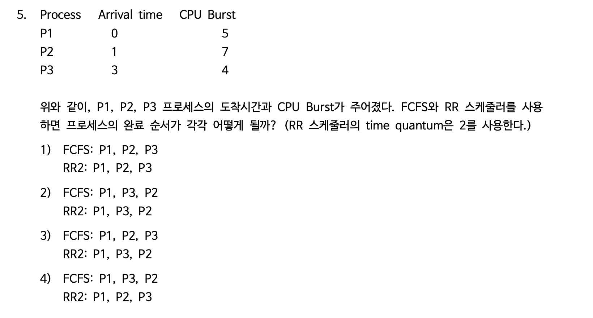

# CPU 스케쥴링

멀티 프로그래밍 운영체제에서의 기본. CPU burst와 I/O burst 사이에서 프로세스가 왔다갔다함. 근데 CPU만 열심히 쓰는 CPU-bound가 적음!! 오히려 I/O bound가 많음. 그러니 time-scheduling을 하자. 

CPU 스케쥴러는 ready 상태에 있는 프로세스 중 어떤 것에 CPU를 할당할까 결정하는 것. 

우선순위를 어떻게 부여할까? 

Preemptive(선점형) / Non-Preemptive. 비선점형은 CPU를 프로세스가 선점하면 프로세스가 자발적으로 나오기 전까지는 걍 냅둔. 선점형은 쫓아낼 수 있다. 

Decision Making

1. running -> waiting
1. running -> ready
1. waiting -> ready
1. terminates

1번과 4번은 비선점형. 2번과 3번은 둘 다 가능. 

dispatcher는 CPU 코어의 컨트롤을 주는 모듈. 스케줄러는 선택하고 디스패처는 실제로 스위칭해준다.  

- 프로세스끼리 맥락 스위칭
- 유저 모드 스위칭
- 작업 재개를 위해 적합한 위치로 점프

디스패쳐는 겁나 빨라야한다. Context switching때마다 불리기 때문. Dispatch latency. 이게 CPU 실제 사용시간보다 길면,,,ㅠ 윈도우에서는 vmstat으로 보고, 맥은 sudo latency인듯?

스케줄링 목표

- CPU utilization
- Throughput: the number of processes completed per time unit
- **Turnaround time**: 프로세스의 실행에 얼마나 걸리는가? 실행부터 종료까지의 시간
- **Waiting time!**: ready queue에서 기다리는 시간을 줄이기
- Response time

The solutions for the scheduling problem

- FCFS: First-Come, First-Served
- SJF: Shortest Job First(SRTF: Shorted Remaining Time First)
- RR: Round-Robin. 시분할(time-sharing)을 해서 정해진 시간만큼만. 
- Priority-based
- MLQ: Multi-Level Queue
- MLFQ: Multi-Level Feedback Queue

FCFS. 가장 간단함. 구현하기 쉬움. 

Total waiting time = 0 + 24 + 27 = 51, 평균 17초. Turnaround는 평균 27초.
2->3->1이면 평균 3초 기다림. Turnaround는 13초.
CPU-burst time에 따라 값이 확확 바뀜. non-preemptive하다. 끝날때까지는 cpu를 내려놓지 않음. 
Convoy Effect(호송 효과): 큰 하나의 프로세스가 CPU에서 나올 때까지 모든 다른 프로세스들이 기다린다. 

SJF. shortest-next-CPU-burst-first scheduling. FCFS와 달리 provably optimal하다. 귀류법?으로 증명 가능한 듯. 하지만 next CPU burst time을 알 수 있는 방법이 없다. 예측할 수밖에 없음. 과거 측정값의 exponential average. 근데 이걸 위해 용량이 많이 필요하고 SJF는 이론적으로 optimal이지 실제로 사용하는건 아니다. 
선점, 비선점 모두 가능하다. ready에 새로운게 왔을 때 원래 실행되던걸 어떻게할지는 선택. 근데 이짓도 새로온거 시간을 알아야 ^^

암튼 여기서 선점을 시킨다면 SRTF. Shortest-Remaining-Time-First는 preemptive. 새로 온 CPU burst가 현재 돌아가는 것보다 작으면 preempt.

RR Scheduling. Round-Robin. Preemptive FCFS with a time quantum. watchdog 타이머가 쫓아냄. 보통 10-100milliseconds. Ready queue는 circular queue. 
time quantum에 따라 성능이 많이 달라짐. quantum이 작으면 context switch가 많이 발생함. Dispatch latency. 

Priority-base Scheduling. 선점 비선점 다 가능.
The problem of starvation. 낮은 우선도의 프로세스는 계속 기다릴 수도 있다. 
aging으로 해결. 점진적으로 우선도를 높인다. 
RR이랑 합쳐서 같은 우선도의 프로세스는 rr로 스케쥴링할 수도 있다. 

Multi-Level Queue(MLQ). 우선도별 ready queue. 

Multi-Level Feedback Queue(MLFQ). 점점 quantum을 높게 줌. 실전 os적인 알고리즘. 

현대 컴퓨터에서는 쓰레드 스케줄링을 한다. 그중에서도 kernel thread만 스케줄링하면 된다. user thread는 thread library가 해준다. kernel은 얘네를 신경 안쓰고 매핑만 해주면 된다. 

Real-Time Operating System에서의 스케줄링. 주어진 시간 내에 task를 완료할 수 있는 OS. 
Soft RealTime: critical real-time process가 noncritical보다 우선되면 됨. 
Hard RealTime: task가 데드라인 내에 무조건 완료되어야한다. 반드시 우선도를 가지고 스케줄링 되어야한다. 

대기 시간은 들어온 것 기준으로!!! 없는 것도 치지 않음. 

