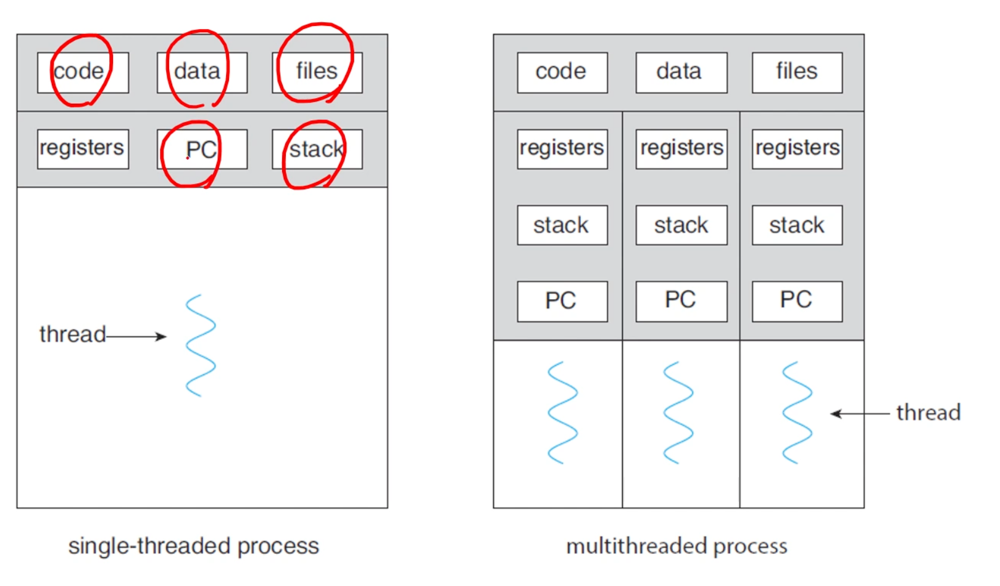
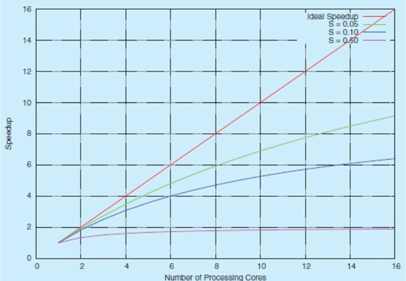

지금까지는 single thread of control인 프로세스들을 살펴봄. 하지만 multiple threads of control을 가질 수 있다. PC를 잘 바꾸면 같은 프로그램 내에서도 여러 context의 코드를 실행할 수 있다. 

A thread is a lightweight process(LWP). A basic unit of CPU utilization. 

- thread ID
- program counter
- register set
- stack

으로 구성된다. 



## Multithreading의 장점

client-server 시스템에서 여러 request를 함께 처리할 수 있다. 

- Responsiveness: may allow continued execution
- Resource Sharing: threads share resources of process(code와 data 영역을 공유함)
- Economy: cheaper than process creation
- Scalability(확장성): process can take advantage of multiprocessor architectures

자바에서 쓰레드는 프로그램 실행의 기본적인 모델이다. 쓰레드 생성과 관리를 위한 많은 기능들이 있음. 

## 자바에서의 쓰레드 사용

Inheritance from the Thread class
- 다른 클래스 상속이 안되는 문제. 다른 방법 쓰기

```
public class MyThread1 extends Thread {
    public void run() {
        try {
            while (true) {
                System.out.println("Hello, Thread!");
                Thread.sleep(500);
            }
        } catch (InterruptedException ie) {
            System.out.println("I'm interuppted");
        }
    }
}

public class testcode {
    public static final void main(String[] args) {
        MyThread1 thread = new MyThread1();
        thread.start();
        System.out.print("Hello, My Child!");
    }
}
```

Implementing the Runnable interface
- 제일 많이 씀. 

```
public class MyThread2 implements Runnable {
    public void run() {
        try {
            while (true) {
                System.out.println("Hello, Runnable!");
                Thread.sleep(500);
            }
        } catch (InterruptedException ie) {
            System.out.println("I'm interrupted");
        }
    }
}

public class testcode {
    public static final void main(String[] args) {
        Thread thread = new Thread(new MyThread2());
        thread.start();
        System.out.print("Hello, My Runnable Child!");
    }
}
```

Using the Lambda expressing(1.8~)
- 새로운 클래스도 귀찮고, 람다로 구현

```
public class testcode {
    public static final void main(String[] args) {
        Runnable task = () -> {
            try {
                while (true) {
                    System.out.println("Hello, Lambda Runnable!");
                    Thread.sleep(500);
                }
            } catch (InterruptedException ie) {
                System.out.println("I'm interrupted");
            }
        };
        Thread thread = new Thread(task);
        thread.start();
        System.out.println("Hello, My Lambda Child!");
    }
}
```

부모 쓰레드의 대기: Join

```
public class testcode {
    public static final void main(String[] args) {
        Runnable task = () -> {
            for (int i = 0; i < 5; i++) {
                System.out.println("Hello, Lambda Runnable!");
            }
        };
        Thread thread = new Thread(task);
        thread.start();
        try {
            thread.join();
        } catch (InterruptedException ie) {
            System.out.println("Parent thread is interrupted");
        }
        System.out.println("Hello, My Joined Child!");
    }
}
```

쓰레드의 종료: interrupt

```
public class testcode {
    public static final void main(String[] args) throws InterruptedException {
        Runnable task = () -> {
            try {
                while (true) {
                    System.out.println("Hello, Lambda Runnable!");
                    Thread.sleep(100);
                }
            } catch (InterruptedException ie) {
                System.out.println("I'm interupted");
            }
        };
        Thread thread = new Thread(task);
        thread.start();
        Thread.sleep(500);
        thread.interrupt();
        System.out.println("Hello, My Interrupted Child!");
    }
}
```

프로그램은 짤 줄은 몰라도 6, 7장 동기화 부분에서 자바로 설명하니까 코드는 얼추 알아두기~

## 멀티코어 시스템에서의 멀티쓰레딩

More efficient use of multiple cores for improved concurrency

싱글코어에서는 사이사이 interleaved되겠지만, 멀티코어에서는 몇몇 쓰레드들은 parallel하게 작동할 수 있다. 

Programming Challenge

- Identifying tasks: 여러 문제로 나눌 수 있는 부분이 어디인가?
- Balance: 각 task가 같은 양의 일을 할 수 있도록
- Data splitting
- Data dependency
- Testing and debugging

## 암달의 법칙



---

## 멀티쓰레딩 모델

user thread / kernel thread

이 둘의 관계

- Many-to-One Model. 가장 기본적. 유저 쓰레드가 많아지면 감당 못함. 
- One_to_One Model. 
- Many-to-Many Model

쓰레드 라이브러리는 쓰레드를 만들고 관리하는 API이다. 

> An application programming interface (API) is a connection between computers or between computer programs. It is a type of software interface, offering a service to other pieces of software.

> The interface to a software library is one type of API. The API describes and prescribes the "expected behavior" (a specification) while the library is an "actual implementation" of this set of rules.

> In computing, an interface is a shared boundary across which two or more separate components of a computer system exchange information.

POSIX Pthreads, Windows thread, Java thread(얘네는 운영체제꺼 끌어다? 씀)

```
#include <stdio.h>
#include <stdlib.h>
#include <pthread.h>

// data shared by the threads
int sum;
// thread call this function
void *runner(void *param);

int main(int argc, char *argv[])
{
    pthread_t tid;       // thread identifier
    pthread_attr_t attr; // thread attributes;

    pthread_attr_init(&attr);
    pthread_create(&tid, &attr, runner, argv[1]);
    pthread_join(tid, NULL);

    printf("sum = %d\n", sum);
}

void *runner(void *param)
{
    int upper = atoi(param);
    sum = 0;
    for (int i = 1; i <= upper; i++)
        sum += i;
    pthread_exit(0);
}
```
*-pthread 옵션 안줘도 작동하긴 함*

main thread는 기본으로 있는듯!

## The Strategy of Implicit Threading

알아서 쓰레딩 해줘~

The design of concurrent and parallel applications

- i.e. the design of multithreading in multicore systems, 
- is too difficult for application developers.

So, transfer the difficulty to compiler and run-time libraries.

네가지 접근법

- Thread Pools: 쓰레드 유저가 안만들고 Thread Pool에서 잘 가져다 쓰게. getThread
- Fork & Join: 책~!
- OpenMP: 컴파일러 지시문, API로 C/C++에서 
- Grand Central Dispatch(GCD): 애플에서 사용

OpenMP: parallel region만 지정해주면 코드블럭을 알아서 parallel하게 실행해줌. 지금까지와는 달리 라이브러리가 아닌 컴파일러에게 지시. 

```
#include <stdio.h>
#include <omp.h>

#define SIZE 100000000

int a[SIZE], b[SIZE], c[SIZE]

int main()
{
    for (i = 0; i < SIZE; i++) 
    {
        a[i] = b[i] = i;
    }
    #pragma omp parallel for
    for (i = 0; i < SIZE; i++)
    {
        c[i] = a[i] + b[i];
    }
    return 0;
}
```
*이건 테스트는 못해봄. macOS에 기본적으로 안깔려져있음*

여러번 실행됨! 병렬이라서. 
omp_set_num_threads(4);, omp_get_thread_num? 도 사용할 수 있음. 
time 써서 시간 측정해보면 병렬처리를 위한 대기 등때문에 user가 긺. 

1 2 (2, 3) 2 3 4 2 3

```
#include <stdio.h>
#include <stdlib.h>
#include <pthread.h>
#include <unistd.h>

void runner()
{
    printf("Hello I'm thread\n");
    pthread_exit(0);
}

int main()
{
    pthread_t tid;       // thread identifier
    pthread_attr_t attr; // thread attributes;
    pthread_t tid2;      // thread identifier

    pthread_attr_init(&attr);
    pthread_create(&tid, &attr, runner, NULL);
    pthread_create(&tid2, &attr, runner, NULL);
    fork();
    pthread_join(tid, NULL);
    pthread_join(tid2, NULL);
}
```
*쓰레드도 같이 복사되는듯!*


사실 start() 호출되었다고 바로 실행되는 구조가 아니다. 일단 먼저 '실행대기' 상태에 들어가게 되며 자신의 차례가 오면 실행되는 구조이다. 물론 실행대기 중인 쓰레드가 하나도 없다면
바로 실행 상태로 넘어간다.
참고: 쓰레드의 실행순서는 OS의 스케줄러가 작성한 스케줄에 의해 결정된다.

이거때문인가??

