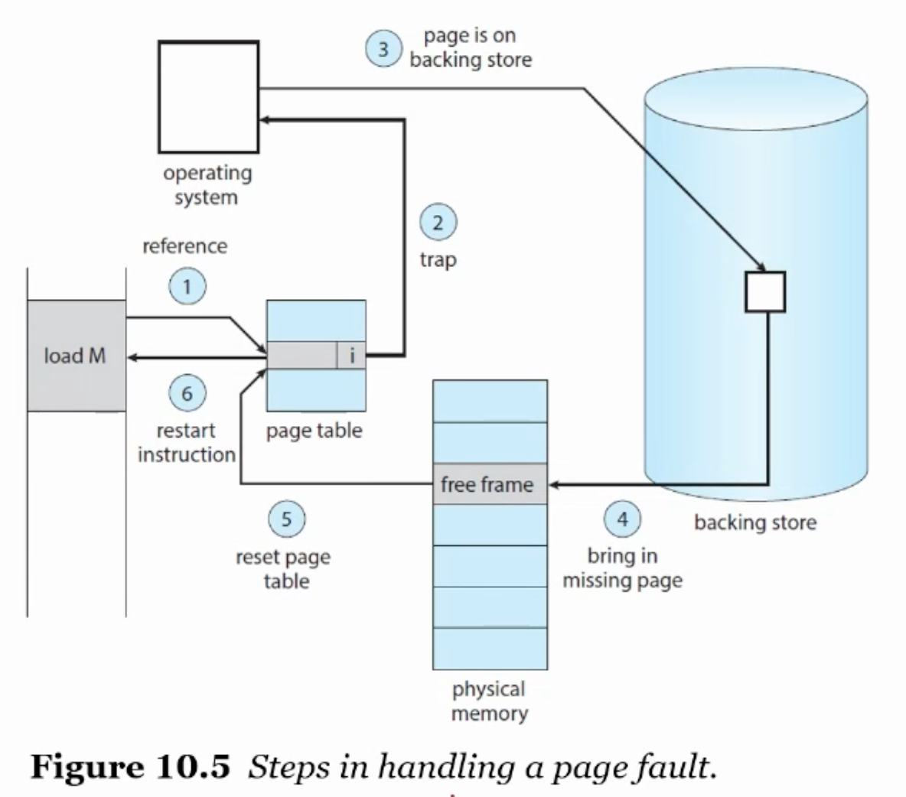

## 가상 메모리와 디맨드 페이징

가상메모리: 프로그램 전체가 메모리에 있지 않아도 실행할 수 있게 해주는 기술

Virtual Address Space: 연속적인 메모리. 

페이지를 공유해서 파일과 메모리를 여러 프로세스간 공유할 수 있다. 

a.out 파일이 어떻게 동작할까.

- 이차 저장매체에서 메모리로 로딩한다. 하드디스크에 있을 땐 프로그램, 메모리로 로딩되면 프로세스. 
- 전체 다 로딩할 필요는 없다. 
- demang paging이란 필요할 때 로딩하는 것. 가상 메모리 시스템에서 보통 사용한다. 

디맨드 페이징의 기본 개념

프로세스가 실행중이면 어떤건 메모리에, 어떤건 이차 저장매체에. 이 두가지 상황을 valid-invalid bit로 구분해야함. 

Page Fault는 어떻게 처리할까?

1. valid한지 체크
1. invalid하면 프로세스 종료, valid인데 page fault이면 Page in 진행. 
1. Free frame 탐색. 
1. 이차 저장매체에서 필요한 페이지를 읽어옴
1. Internal table과 page table을 수정해 이제 메모리에 페이지가 있음을 표시. 

오 사진에서 텍스트 크기를 찾아 사진 크기를 조절해주는 프로그램을 만들어볼까?

Pure Demand Paging: 요청하지 않으면 절대로 페이지를 가져오지 않는다. 메모리에 페이지가 없는 상태로 프로세스 실행을 시작할 수 있다. Intruction pointer가 가르키는 첫번째 명령어가 page fault를 일으키면, 그때부터 하나씩 page in해온다. 

Locality of Reference: 참조 국부성. 데이터가 여러 페이지에 있으면 명령어 한번에 여러 page fault가 발생할 수 있지만, 보통 참조의 지역성(국부성)이 있다. 

예시 해봤는데, 최적화 옵션 끄고 해야되는 듯. 숫자 커지면 최적화 옵션 상관 없는지도? 그리고 할 때마다 속도가 빨라지는건 기분탓인가? main함수 내부에 하면 스택 터져서 segmentation fault나는것도 신기. [링크](https://stackoverflow.com/questions/7902228/segmentation-fault-large-arrays)

[What can cause a program to run much faster the second time?](https://stackoverflow.com/questions/7561362/what-can-cause-a-program-to-run-much-faster-the-second-time)

이걸로 글 써볼까?!

자료구조와 프로그래밍 구조를 잘 선택하자~~

디맨드 페이징을 위한 하드웨어 지원. 

- 이차 저장매체에 swap space를 할당에 운영체제가 쓸 수 있게. SSD를 쓰면 swap 속도가 빠르다. SSD 관련해서 찾아보는 것도 좋을듯?

Instruction Restart. Fault가 일어났을 때 context switching. 같은 상태에서 restart를 해줘야 함. Page table이 안사라지게 해야 함. 최악의 경우 앞에 것들도 다시 해야된다. 

Free Frame List. 

copy on write

## 페이지 교체 알고리즘

Page Replacement: 남은 프레임이 없을 때 하나를 비워 그곳에 넣는 것. 

남은게 없으면 page-replacement algorithm을 사용해야한다. 

두 가지 문제점

1. Frame-allocation algorithm: 각 프로세스에 몇 개의 프레임을 할당할까?
1. Page-replacement algorithm: 어떤 프레임을 없앨까?

FIFO Page Replacement: 가장 심플. 
Belady's Anomaly: 프레임을 많이 줬는데 page fault가 더 많이 일어나는 현상. 

Optimal page replacement. 절대 belady's anomaly를 경험하지 않는다. 가장 쓸 일이 없을 것 같은걸 버려야 한다. 
하지만 미래에 대한 정보를 알아야해서 어렵다! 다른 것과 비교하는 용도로 쓴다~

**LRU**. 최근의 사용을 통해 가까운 미래를 예측. 하드웨어 지원이 필요하다는 단점. Belady's anomaly를 겪지 않는다. 

- Counter implementation. 
- Stack implementation. 

사실 reference bit 정도의 지원만 해준다? 순서는 알 수 없음. 

Second-Chance Algorithm. FIFO + ref. bit

The Issues for Frame Allocation. 프로세스별로 프레임을 몇 개 배정할까?

- equal allocation
- proportional allocation

- local replacement
- global replacement

개념만 알자~ 자세한건 책에. 

Thrashing. Swapping 때문에 오히려 느려짐. 
Working-Set Model. 지역성이 있다고 가정하고 뎅타 크기의 working set window를 지정. 

2 

10

14